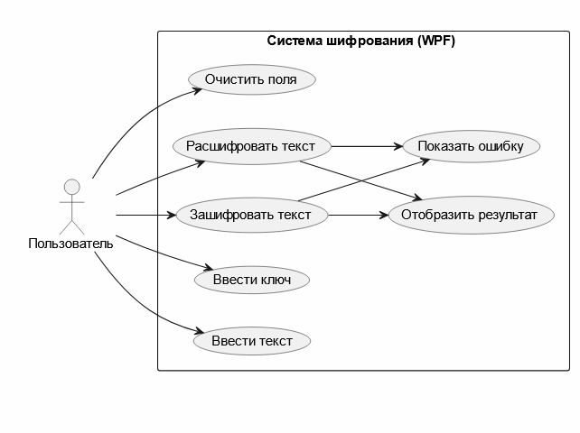

## Диаграмма вариантов использования

В системе участвует один актор — пользователь.

Пользователь может:
- вводить текст;
- вводить ключ;
- выполнять шифрование;
- выполнять дешифрование;
- очищать поля ввода.

Система обрабатывает вводимые данные, выполняет преобразование текста
и выводит результат. В случае некорректного ввода отображается сообщение об ошибке.


plantuml.com


```
@startuml
left to right direction
skinparam packageStyle rectangle

actor "Пользователь" as User

rectangle "Система шифрования (WPF)" {

    usecase "Ввести текст" as UC1
    usecase "Ввести ключ" as UC2
    usecase "Зашифровать текст" as UC3
    usecase "Расшифровать текст" as UC4
    usecase "Очистить поля" as UC5
    usecase "Отобразить результат" as UC6
    usecase "Показать ошибку" as UC7

    UC3 --> UC6
    UC4 --> UC6

    UC3 --> UC7
    UC4 --> UC7
}

User --> UC1
User --> UC2
User --> UC3
User --> UC4
User --> UC5

@enduml
```

